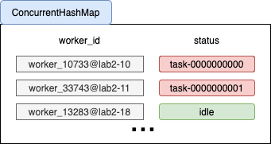

## ZooKeeper & Distributed Computing 

This project develops a simple distributed computing platform following a master-worker(s) architecture that uses ZooKeeper for coordination. The high-level objective of the platform is that a client can submit a "task/job" for computation to the platform, which will execute the task/job using one of its many workers and provide the client with the result. 

### Model Overview

The znode hierarchy of our implementation is shown in the above figure.  We made the underlying assumption that the znodes **/dist24**, **/workers** and **/task**s will always be present in the system. Creating the master node is the starting point of our system.  After the master node iscreated, all newly created worker znodes will be then put under **/workers** znode.  Upon the platform shuts down, the **/master** and  all **worker-pid@hostname** znodes created will automatically be removed.  The master andworker znodes are of type **ephemeral**. The task znodesare of type **persistent**.  For each type of znodes in our implementation:

* **master**:  The  central  coordinator  to  keep  track  of workers and tasks as well as assign tasks to available workers.   No  data  is  stored  in  the  master  znode. However, we have created 2 data-structures to hold the tasks and workers. 
* **worker-pid@hostname**: The worker znode do the computation  for  the  tasks  assigned  to  it.   It  also returns the finished task objects to the client.  The data stored in each of the znode is the status (i.e.”idle” or the ID of the task it is currently assigned to).
* **task**:  The task znode are created by the client pro-gram.  When the master detects the creation of thetask  nodes  with  the  watcher,  it  assigns  workers  toexecute the task.  When the worker finishes the task,it creates a result znode under/tasks, which will bedetected and cleaned up by the client program.

### Implementation

#### Master and Worker Znodes Creation

Upon being executed, all the server programs will try to become the master znode. Once a master znode is up and running, subsequent instances will be created as worker znodes. The master znode is put under /dist24 and all the worker znode is put under /dist24/workers. Each worker znode will have a unique identifier in the form of **worker\_pid$@$hostname**. 

The master znode will monitor on path **/dist24/worker** for changes in children node to detect if there is a newly created worker nodes. If a new worker node is detected, master node will register the new worker node by adding them into a HashMap which keeps track of the existing worker nodes as well as their status. The figure below shows the configuration of the HashMap. 

#### Monitoring New Tasks

The master znode will monitor on path **/dist24/tasks** for changes in children nodes to detect if there are any newly created tasks submitted by the client. 

#### Tasks Assignments to Workers

In our implementation, we used two key data structures to facilitate the task assignments.

* HashMap:  A ConcurrentHashMap (String,  String) is used to store the registered workers and their status.

* LinkedQueue:  A ConcurrentLinkedQueue is used tostore the awaiting tasks when no workers are avail-able.  This queue makes sure that the jobs are pri-oritized based on their coming order.

Once the master detects a newly submitted task, it willretrieve the first available worker with status ”idle” from. The task assignment is done through setting the data of the worker node from "idle" to the task ID as a byte array. After the worker detects a node data change, it retrieves the node data and find the corresponding task object from /tasks/task-xxxxxxx path. It spawns a new thread to which it delegates the computation. Once the computation is finished, the worker will create a result znode under /tasks/result and set its own data from "task-xxxxxxxx" back to "idle". The master will immediately be aware of the node data change through the watcher attached to it and updates the HashMap entry of the corresponding worker back to "idle".

However, if no worker with status "idle" is found upon receiving a new task, the ID of the task will be added to the LinkedQueue. Figure below shows the execution logic for the below scenarios. Every time the master gets notified by a worker that its node data changes which signals the completion of a task, it will pop the task that comes in first from the awaiting task queue and assign it to the newly freed worker for computation.

Furthermore, every time a new worker is detected by master, it will check if there are any awaiting tasks inside the task queue. If there is, the master will immediately take an awaiting task and assign it to the newly added worker.

#### Worker Disconnection

After the master is up and running, if a worker process terminates. The master will be notified by a node change under /dist24/workers path through the installed watcher. If will then compare the list of children nodes under the direction and compares them with the currently registered workers. If there is a mismatch, it will de-register the worker who is not currently present under /dist24/workers path but has been registered by the master. The whole process "removes" a worker node from the system. However, the mechanism works under the assumption that the worker to be removed should be "idle" by the time of the operation and no tasks is being assigned to it.

#### Znodes Clean Up

In our implementation, as mentioned, master and worker znodes are of type ephemeral and they will automatically be removed after the program is terminated. 

### 

